# Repo lineage (ecosystem map)

How all of Chan's repositories relate to each other: which repos were built for the same company or brand, which one replaced which, and which are backups, forks, promo films or growth workspaces. Verified 2026-10-02 against GitHub: **150 public-catalog repos** (51 of them private on GitHub) in **26 entities** and **37 families**, plus 117 typed relations. Repos with sensitive names live only in a local overlay (see below); 9 such repos hang off families here and are counted in each family's `privateRepoCount`.

## What the files are

| File | Tracked | Purpose |
|---|---|---|
| `docs/ecosystem/lineage.yaml` | yes | The machine catalog: entities, families (with dated timelines), repos, typed relations, non-git assets, open questions |
| `docs/ecosystem/lineage.private.yaml` | **no** (gitignored, local-only) | Overlay with the sensitive repos and every relation touching them. Same schema subset. Read it when it exists; never copy its contents into tracked files |
| `docs/ecosystem/archlang-archcanvas.{md,yaml}` | yes | Deep dive for the ArchLang / ArchCanvas family (linked from its family via `detail:`) |
| `scripts/check-ecosystem.mjs` | yes | Validator, `npm run check:ecosystem` (offline, part of `npm run validate`) and `npm run check:ecosystem -- --live` (compares with GitHub) |

**Precedence.** Career facts (titles, dates, metrics, claims) live in `data/profile/*.yaml` and nothing here overrides them. This catalog is topology only: it is not loaded by `load-profile`, it feeds no README, CV or LinkedIn surface, and it is not career copy. Where it names a `catalogId`, `workId` or `orgId`, those ids are checked against `data/profile`.

**Scope.** Personal account `ChanMeng666` plus exactly nine org repos she built or led (`scope.orgRepoAllowlist`). Every other repo in the gavigo-inc, NZ-SheSharp, Chow-Luck-Club, Whiri-AI, archcanvas and Sanicleai orgs was NOT built by Chan: never attribute it to her.

## How to query

```bash
# every repo of an entity, with role and state
node -e "const y=require('js-yaml').load(require('fs').readFileSync('docs/ecosystem/lineage.yaml','utf8'));console.log(y.repos.filter(r=>r.entity==='gavigo').map(r=>r.repo+' '+r.role+' '+r.visibility+(r.archived?' archived':'')).join('\n'))"
# what depends on / promotes / documents a repo
node -e "const y=require('js-yaml').load(require('fs').readFileSync('docs/ecosystem/lineage.yaml','utf8'));console.log(y.relations.filter(r=>r.to==='ChanMeng666/archlang'))"
# validate, then compare with live GitHub
npm run check:ecosystem
npm run check:ecosystem -- --live
```

Or just grep: `grep -n "family: she-sharp-platform" docs/ecosystem/lineage.yaml`. A repo row looks like `{repo, family, entity, role, visibility, archived, catalogId, localFolder, created, liveUrls, oneLine, confidence}`; `localFolder` is relative to `localRoot` (`D:/github_repository`). `--live` run without the overlay reports the overlay repos as uncovered, so run it on the machine that has the overlay.

## Relation vocabulary

A relation is `{from, type, to, evidence}`. `from` is always a repo in the catalog. `to` is a repo, or `external:owner/name` (upstream or foreign copy), `url:https://...` (live deployment or studied site), `entity:<id>` or `asset:<id>` (non-git asset).

| type | meaning |
|---|---|
| `depends-on` | code/package dependency (from consumes to) |
| `powers` | from is the engine/runtime of to |
| `extends` | from extends/builds on to |
| `companion-of` | sibling product repos meant to be used together |
| `successor-of` | from (newer generation) replaces to |
| `rewrite-of` | from is a rewrite of to |
| `backup-of` | from is a backup copy of to |
| `snapshot-of` | from is a point-in-time snapshot of to |
| `fork-of` | from is a fork of to (upstream may be external:owner/name) |
| `derived-from-template` | from was generated or generalised from to |
| `same-codebase-as` | private/public split of one codebase |
| `mirror-of` | from and to share history (copy or fork); to may be an external:owner/name copy |
| `renamed-from` | from was previously named to (old name redirects) |
| `promotes` | promo film / marketing asset for to |
| `markets` | growth / go-to-market workspace for to |
| `documents` | paper, docs or report for to |
| `showcases` | demo or examples of to |
| `studies` | crawl/study copy of an external site or app |
| `data-for` | export/archive that feeds to |
| `deployed-as` | from is deployed at url:... (live domain) |
| `built-for` | from was built for an entity (entity:<id>), only where not obvious from the family |
| `listing-submission-for` | from is Chan's fork of someone else's awesome-list, kept only to submit `to` (her own project) for listing; the fork itself is NOT her project (`ownProject: false`) |
| `forked-by` | to (`external:owner/name`) is a fork of from, continued by someone else (handover); from stays the original build |

Legend in the diagrams below: 🔒 private on GitHub, 📦 archived.

**`ownProject: false`.** A repo that carries this flag in `lineage.yaml` is a fork or listing submission of someone else's work and is never counted as one of Chan's own repos or projects (see the external-upstreams entity below). The validator requires it on every fork and listing-submission under that entity.

## Entities with several repos

### ArchCanvas / ArchLang (own venture)

`archcanvas` · own-brand · Founder / solo builder (career work id archcanvas) · 11 repos in 1 family · career work id `archcanvas`

ArchCanvas (private Next.js app, first commit 2026-04-08) consumes the ArchLang compiler (npm @chanmeng666/archlang; repo created 2026-06-24; replaced the product's freehand engine 2026-06-25). Around them: a public product home and org profile in the archcanvas org, a private growth HQ that is editorial authority for three successive promo-film repos, a private paper repo, a public showcase gallery and a private ArchLang demo film. Full topology: docs/ecosystem/archlang-archcanvas.yaml (verified 2026-09-21; archlang-demo-video added since).

Full topology, evidence and diagrams: [archlang-archcanvas.md](archlang-archcanvas.md) and [archlang-archcanvas.yaml](archlang-archcanvas.yaml).

### Seismophone (formerly SunoStats)

`seismophone` · own-brand · Solo founder · 2 repos in 1 family

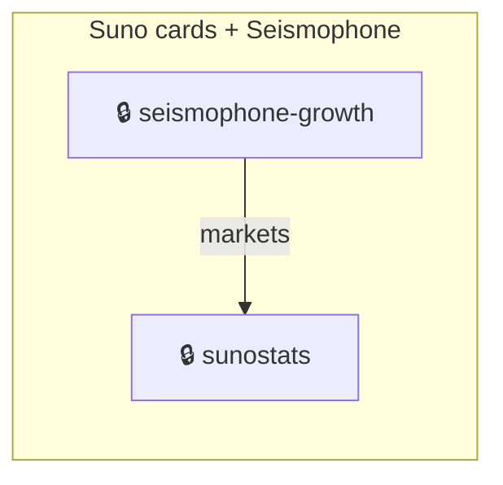

**Suno cards + Seismophone** (`suno-seismophone`, 2 repos). A private monorepo (local folder github-readme-suno-cards, remote suno-research-private) is the research probe and original codebase of the Suno README-cards product; on 2026-04-13 a public extraction (new root commit, 44 commits) became ChanMeng666/github-readme-suno-cards. The research fed Seismophone (repo sunostats; shared @suno-cards/parser kernel), whose growth HQ is seismophone-growth.

- 2026-04-11: suno-research-private created (private monorepo, research + product)
- 2026-04-12: sunostats (SunoStats) created
- 2026-04-13: Public repo github-readme-suno-cards extracted from the private monorepo (v0.1 commit 73f4fa8)
- 2026-07-18: seismophone-growth created; SunoStats rebranded Seismophone at seismophone.chanmeng.org

### github-readme-suno-cards (Suno README cards)

`suno-cards` · own-brand · Author · 2 repos in 0 families

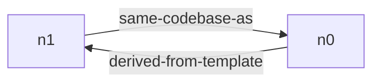

### echook (formerly claude-code-audio-hooks)

`echook` · own-brand · Author · 3 repos in 1 family

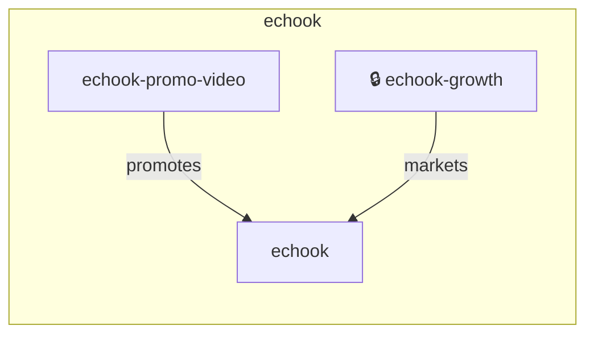

**echook** (`echook`, 3 repos). Audio/status-line notification system for Claude Code, Cursor, Codex. Repo renamed claude-code-audio-hooks to echook. A Remotion promo-video repo and a private growth/research corpus accompany it.

- 2025-11-01: Product repo created as claude-code-audio-hooks (later renamed echook; old name redirects)
- 2026-02-13: echook-promo-video created (README: formerly claude-code-audio-hooks)
- 2026-08-04: echook-growth research corpus created with product-reality-check

### gradient-svg-generator (Chromaflow)

`gradient-svg-generator` · own-brand · Author · 2 repos in 1 family

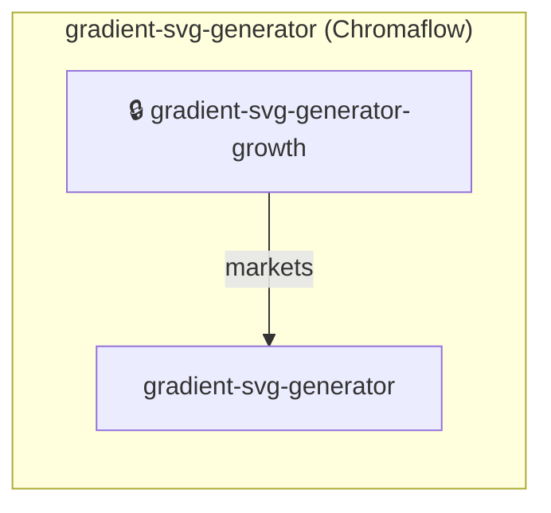

**gradient-svg-generator (Chromaflow)** (`gradient-svg-generator`, 2 repos). Animated gradient SVG banner service used as README decoration across Chan's repos, with a private growth/research corpus beside it.

- 2025-01-06: Product repo created
- 2026-08-04: gradient-svg-generator-growth research corpus created with product-reality-check

### Vitex (vitex.org.nz)

`vitex` · own-brand · Solo founder · 2 repos in 1 family

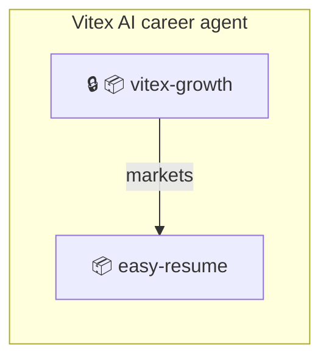

**Vitex AI career agent** (`vitex`, 2 repos). Product repo is easy-resume (created 2025-01-11 as a browser LaTeX resume generator; now Vitex at vitex.org.nz, Typst-based, agent-native). vitex-growth is its private marketing brain. Both archived 2026-10-02.

- 2025-01-11: easy-resume created
- 2026-07-19: vitex-growth created
- 2026-10-02: easy-resume and vitex-growth archived in repo triage round 2

### a11y-loop

`a11y-loop` · own-brand · Author · 2 repos in 1 family

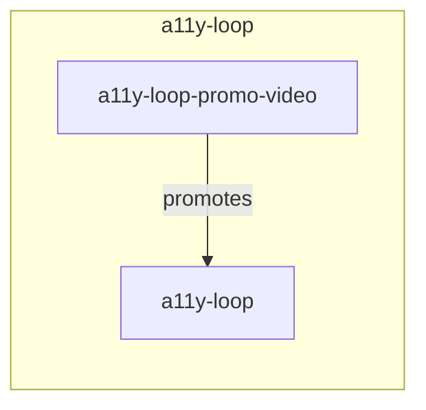

**a11y-loop** (`a11y-loop`, 2 repos). Accessibility tool for AI coding agents plus its Remotion promo film. Also an npm devDependency of sunostats.

- 2026-07-25: a11y-loop created
- 2026-07-28: a11y-loop-promo-video created

### Chan Meng personal brand (chanmeng.org, GitHub profile, logo, CV)

`chan-meng-brand` · personal · Owner · 13 repos in 2 families

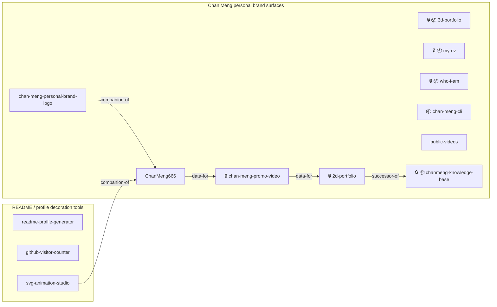

**Chan Meng personal brand surfaces** (`chan-meng-personal-brand`, 10 repos). chanmeng.org (2d-portfolio), the GitHub profile README repo / career database (ChanMeng666), brand logo (chan-meng-personal-brand-logo, shipped as .github/brand/chan-meng-logo.svg in many READMEs), personal films (chan-meng-promo-video, public-videos), knowledge base (retired into chanmeng.org/blog). 3d-portfolio, who-i-am, my-cv and chan-meng-cli were each a separate past attempt at building her personal brand: independent of each other and of the current surfaces, no predecessor/successor chain, all archived (verified on GitHub 2026-10-02).

- 2024-07-12: ChanMeng666 profile repo created (now the career database)
- 2024-10-24: 3d-portfolio (Three.js) created
- 2024-12-03: 2d-portfolio created; serves chanmeng.org
- 2025-01-21: who-i-am created
- 2026-03-19: my-cv (Typst CV) created
- 2026-06-05: chan-meng-personal-brand-logo created; logo-as-code-skill generalised from it next day
- 2026-09-09: chan-meng-promo-video created (plays on chanmeng.org)
- 2026-10-02: 3d-portfolio, who-i-am, my-cv and chan-meng-cli confirmed independent past personal-brand pieces (no succession) and archived on GitHub

**README / profile decoration tools** (`github-readme-decoration-tools`, 3 repos). Chan's own README-visual products (gradient-svg-generator, github-visitor-counter, github-readme-suno-cards, svg-animation-studio, readme-profile-generator) plus skills readme-showcase and readme-theme-assets-skill. Evidence of use: sunostats README embeds gradient-svg-generator banners and readme-showcase blocks; career-repo rule restricts README visuals to these tools.

- 2024-12-13: readme-profile-generator created
- 2025-07-16: github-visitor-counter created
- 2026-06-03: svg-animation-studio created
- 2026-06-12: readme-showcase skill created
- 2026-08-12: readme-theme-assets-skill created

### Chan's open-source Claude skills and tooling

`chan-meng-agent-skills` · personal · Author · 16 repos in 2 families

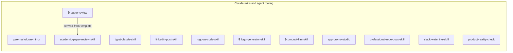

**Claude skills and agent tooling** (`claude-skills`, 12 repos). Standalone repos packaging Chan's workflows as Claude Code skills. product-film-skill generalises the ArchCanvas promo-studio method; product-reality-check produced the echook and gradient-svg-generator growth corpora; logo-generator-skill is a private working copy (not a GitHub fork) of op7418/logo-generator-skill; website-building-agent is a bolt.diy fork archive.

- 2026-03-16: typst-claude-skill created
- 2026-06-05: app-promo-studio plugin created
- 2026-06-06: logo-as-code-skill created
- 2026-08-04: product-reality-check created; same day echook-growth and gradient-svg-generator-growth appear
- 2026-09-21: product-film-skill created (case study = archcanvas)

**Google MCP servers** (`mcp-google-servers`, 2 repos). server-google-news and server-google-jobs MCP servers (Dec 2024). Chan's commit 'Add Google News MCP Server' sits in her fork of punkpeye/awesome-mcp-servers, a listing submission (the fork is not her project).

Repos: server-google-news (product), server-google-jobs (product)

- 2024-12-29: server-google-news created
- 2024-12-31: server-google-jobs created

### Personal workspaces and study copies

`chan-meng-personal-workspaces` · personal · Owner · 4 repos in 1 family

**Personal workspaces and study copies** (`personal-workspaces`, 4 repos, +5 in the local overlay). Standalone personal tooling, research workspaces and offline study copies of external sites/games. No product lineage between them; some are private and described only in the local overlay.

Repos: 🔒 📦 linkedin-jobs-search (product; unrelated to Vitex), 🔒 📦 serpdata-api-test (experiment), 🔒 📦 drawio (archive-snapshot), 🔒 📦 mahsamccauley-web-crawl (crawl-archive; a design study only, no collaborator or project link)

- 2026-10-02: Round-2 triage archived many of these

### External projects and sites Chan forked or studied

`external-upstreams` · community · Fork owner / listing submitter · 11 repos in 1 family

> **None of these repos is Chan's own project** (`ownProject: false` in `lineage.yaml`). They must not be counted as her repos, projects or contributions.

**Forks of external projects** (`upstream-forks`, 6 repos). Public forks of other people's repos. Five are awesome-list forks created on 2026-09-14. The lists themselves (Awesome-AECO, awesome-aec-mcp, awesome-mcp-servers, awesome-generative-ai, awesome-typescript) are public promotion/listing projects led by other people; Chan forked each only to submit her own project (ArchLang; earlier also her Google News MCP server) for listing, as the `add-archlang*` branches on the forks show. Role: `listing-submission`, relation `listing-submission-for` pointing at her own project. reveal.js is a plain fork (`fork`), also not hers, as is the private `website-building-agent` (a fork archive of stackblitz-labs/bolt.diy).

Repos: Awesome-AECO (listing-submission), awesome-aec-mcp (listing-submission), awesome-generative-ai (listing-submission), awesome-mcp-servers (listing-submission), awesome-typescript (listing-submission), reveal.js (fork)

- 2026-09-14: Five awesome-list forks created on the same day, each only to submit her own project for listing (add-archlang* branches); not her projects

### GAVIGO Inc.

`gavigo` · employer · Founding Principal Engineer, Activation, Execution & AI Systems (prev. Core Engineer) (2025-10 – 2026-09) · 4 repos in 1 family · career work id `gavigo` · network id `gavigo`

Delaware C-Corp; Founder & CEO Saba Gecgil. Only gavigo-inc/gavigo-ire and gavigo-inc/gavigo-website are hers; other gavigo-inc repos are NOT.

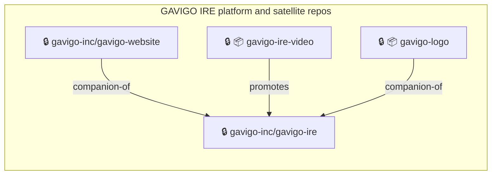

**GAVIGO IRE platform and satellite repos** (`gavigo-ire`, 4 repos, +2 in the local overlay). IRE (Instant Reality Exchange) is the AI-driven container-orchestration product at ire.gavigo.com; the company/investor site, brand logo and promo film were built around it by Chan as sole engineer, alongside internal workspaces described only in the local overlay.

- 2025-10: Chan joins GAVIGO as Core Engineer (work id gavigo)
- 2026-01-21: gavigo-ire created (Spec Kit initial commit); 510 commits by 2026-09-28; live as ire.gavigo.com
- 2026-03-16: Remotion promo video for IRE started in Chan's own account
- 2026-06-06: Logo reconstructed as code (bitmap -> Bezier/circle/triangle SVG)
- 2026-06-21: gavigo-website V1 - standalone company/investor site (gavigo.com), decoupled from the IRE runtime
- 2026-09: Chan's GAVIGO tenure ends (2026-09); last pushes 2026-09-20/26/28

### She Sharp

`she-sharp` · employer · Senior Full Stack Engineer & Website Team Lead (2025-07 – 2026-09); also Ambassador, Website Team (she-sharp-ambassador) · 10 repos in 2 families · career work id `she-sharp` · network id `she-sharp`

NZ women-in-STEM charity (CC57025). GitHub org NZ-SheSharp. Local folders: she-sharp, she-sharp-reports, she-sharp-transformation-record, she-sharp-promo-video-event-lesmills-03-september-2026 (the others have no local-map entry).

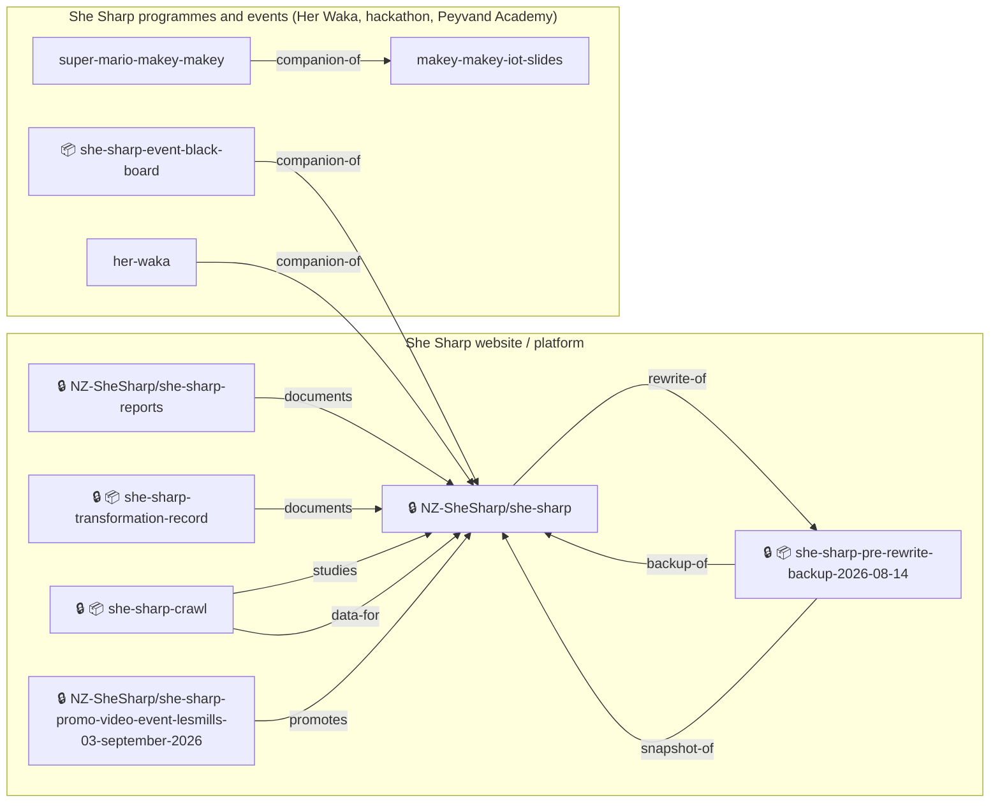

**She Sharp website / platform** (`she-sharp-platform`, 6 repos, +1 in the local overlay). The main shesharp.org.nz Next.js platform (NZ-SheSharp/she-sharp), its frozen pre-rewrite backup, and the report projects split out of it. The pre-2025 site was Webflow (confirmed by owner 2026-10-02). Per the transformation record the charity moved off rented software (three platform migrations) onto owned infrastructure.

- 2025-07-22: she-sharp initial commit (Next.js 15/TypeScript/PostgreSQL; early deploy she-sharp-zeta.vercel.app)
- 2026-01-19: she-sharp-crawl scrapes shesharp.org.nz + Humanitix events with image archival (later archived); its data fed the she-sharp migration (events import)
- 2026-06-19: Offline welcome board for in-person events
- 2026-08-13: Frozen backup taken as of 2026-08-14, before the rewrite (same root commit a19d429f as she-sharp)
- 2026-08-14: Rewrite proceeds in place in NZ-SheSharp/she-sharp (1449 commits at 2026-09-25; confirmed in place, history preserved)
- 2026-08-31: Les Mills promo video project (event 2026-09-03) created in org
- 2026-09-01: Typst funder + internal reports split out of the website repo into she-sharp-reports; transformation record created

**She Sharp programmes and events (Her Waka, hackathon, Peyvand Academy)** (`she-sharp-programmes`, 4 repos). Separate sites/decks Chan built for She Sharp programmes: HER WAKA (She Sharp x MSD, academyEX), the Aotearoa AI Hackathon assistant, and the 13 June 2026 Peyvand Academy Makey Makey workshop.

- 2025-08-13: event-qa-ai-template starts as the AI Hackathon Festival 2025 Assistant (11 teams, 80+ participants); the 2025 deployment was a separate Vercel project from the same repo
- 2026-02-20: her-waka Mintlify docs site created (4 workshops Mar-Jun 2026) at herwaka.shesharp.org.nz
- 2026-06-10: makey-makey-iot-slides created for Peyvand Academy (13 June 2026)
- 2026-06-13: super-mario-makey-makey ceiling demo for the same workshop
- 2026-08: event-qa-ai-template relaunched as 2026 voice agent at hackathon.shesharp.org.nz (Next.js 16, OpenAI Realtime); last push 2026-08-06

### FemTech Weekend

`femtech-weekend` · employer · Chief Technology Officer (2025-03 – present) · 4 repos in 1 family · career work id `femtech-weekend` · network id `femtech-weekend`

Chengdu, founded 2024 by Zhu Yihan. Local NON-git asset vault D:/github_repository/femtech-weekend-assets (README: durable inputs for femtech-weekend-redthread - Shanghai Summit 2026 media, AI masters/plates, graded hero loop, CJK font sources; back up, do not delete). Distinct from femtech-china.

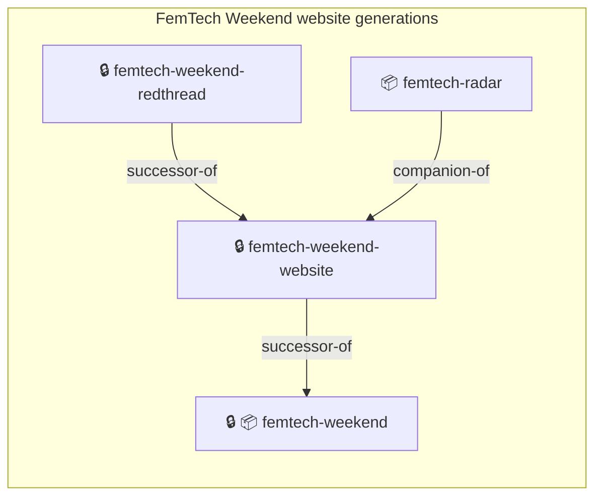

**FemTech Weekend website generations** (`femtech-weekend-site`, 4 repos). Gen-1 Next.js site (2025-03, archived/private) -> Gen-2 Docusaurus + Drizzle/Neon + Cloudflare Pages site at femtechweekend.com (2025-05, carried Shanghai Summit 2026) -> 'The Red Thread' next-gen Next.js/three.js homepage (2026-09), about to replace Gen-2 in production (imminent). femtech-radar is a FemTech Weekend deliverable, now archived and no longer developed.

- 2025-03-16: Gen-1 femtech-weekend (Create Next App) created; later archived and made private
- 2025-05-08: Gen-2 femtech-weekend-website initial commit; Docusaurus, bilingual; femtechweekend.com
- 2026-06-30: femtech-radar - agent-first FemTech intelligence MCP + Astro/RSS site, uses the FemTech Weekend logo
- 2026-09-28: Red Thread homepage repo created (HISTORY.md/CLAUDE.md treat femtech-weekend-website as read-only content source); homepage v3 approved, inner pages next
- 2026-10: redthread replacing website in production - imminent

### Sanicle Inc.

`sanicle` · employer · CTO (prev. Senior AI/ML Infrastructure Engineer) (2025-03 – 2026-02) · 4 repos in 1 family · career work id `sanicle` · network id `sanicle`

US FemTech B2B/B2G SaaS. Has its own GitHub org Sanicleai (private copies of three of her repos; NOT hers by ownership, not in scope).

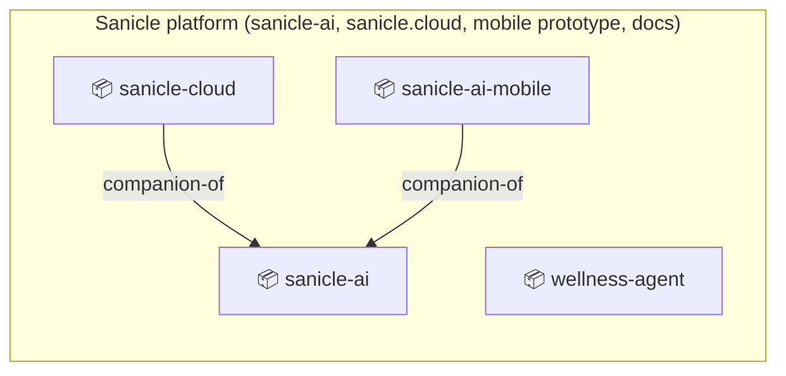

**Sanicle platform (sanicle-ai, sanicle.cloud, mobile prototype, docs)** (`sanicle-platform`, 4 repos, +1 in the local overlay). Chan's Sanicle engineering repos: the multi-tenant B2B app (sanicle-ai), the official sanicle.cloud site (sanicle-cloud), a mobile prototype, and private weekly-report papers. The Sanicleai org holds private copies of three of them (identical root commits); these are deliberate client handover mirrors.

- 2025-02-26: sanicle-ai created as a pre-engagement prototype, before the 2025-03 CTO/engineer start date; root commit 'Initial commit'
- 2025-03-25: sanicle-ai-mobile prototype
- 2025-04-04: sanicle-cloud (catalog sanicle-platform) created; IBM watsonx 'Ask Sani'
- 2025-05-17: Deliberate client handover mirrors of sanicle-ai, sanicle-cloud, sanicle-ai-mobile created in client org Sanicleai/ (same root commits)
- 2025-05-19: wellness-agent (Google ADK workplace wellness; Sanicle-linked in catalog)

### CORDE

`corde` · client · Full Stack Developer & Lead Documenter, Lincoln University COMP693 Industry Placement (2024-06 – 2024-11) · 3 repos in 1 family · career work id `corde` · network id `corde`

Canterbury NZ infrastructure/civil company; capstone for Lincoln University (education id lincoln). Team CORDE = Chan, Clara, Luke.

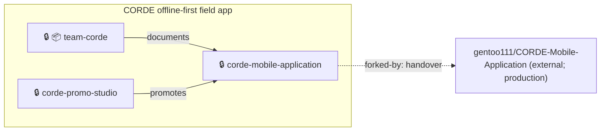

**CORDE offline-first field app** (`corde-field-app`, 3 repos). Lincoln University COMP693 capstone for CORDE: team work log (2024-06-07), the React Native app repo (2024-06-17; Chan's principal build, now handed over), and a 2026 code-generated promo film.

**Handover and the local folder's remotes.** `ChanMeng666/corde-mobile-application` is the original: Chan built the main body of the app and remains its principal developer. GitHub user `gentoo111` then took the project over and forked it (private fork, created 2024-10-12, `gentoo111/CORDE-Mobile-Application`) for continued development of the same product; **CORDE's production product today is that fork**. Hence the local folder `D:/github_repository/CORDE-Mobile-Application` has `origin` = the gentoo111 fork and `upstream` = her own repo. The map records this as relation `forked-by` (handover: maintained by gentoo111; CORDE production runs the fork). The catalog's commit metrics are unchanged.

- 2024-06-07: team-corde work log (COMP693 notes, meetings; Chan, Clara, Luke)
- 2024-06-17: corde-mobile-application created
- 2024-10-12: gentoo111 took over and forked the app to gentoo111/CORDE-Mobile-Application (private; parent = ChanMeng666/corde-mobile-application) - handover; CORDE production runs the fork
- 2026-09-30: corde-promo-studio: Remotion UI-replica promo film, 4 cuts (60/30 s x 16:9/9:16)

### Lincoln University, NZ

`lincoln-university` · university · Master of Applied Computing (Distinction, Dean's List), 2023-11 - 2024-12 · 10 repos in 2 families · network id `lincoln-university`

education id `lincoln` in 10-career.yaml

**Lincoln group-project web systems (club / shop / farm management apps)** (`lincoln-web-systems-coursework`, 5 repos). Five club/business management systems that began as basic HTML/CSS/Flask (or HTML/JS/CSS) university group projects during the Lincoln Master's (repos created 2024-01 to 2024-06), later rebuilt by Chan into modern full-stack apps (Next.js + Neon + Drizzle on Cloudflare Workers/Pages; RepairOS stayed Flask 3 + PostgreSQL). Same assignment genre, same rebuild pattern; no code relationship between them. No course codes appear in READMEs or shards.

Repos: 📦 automotive-repair-management-system (coursework), 📦 biosecurity (coursework), 📦 fishing-club-project (coursework), 📦 countryside-community-swimming-club (coursework), 📦 agrihire-solutions (coursework)

- 2024-01-19: automotive-repair-management-system created (Flask + MySQL repair-shop group project)
- 2024-02-24: biosecurity created (Flask NZ pest/weed guide)
- 2024-03-20: fishing-club-project created (Flask East Coast Anglers Club)
- 2024-05-29: countryside-community-swimming-club created (Flask + MySQL)
- 2024-06-14: agrihire-solutions created (HTML/JS/CSS group project)
- 2026-06: Rebuild era: all five show last pushes 2026-06 (Next.js 16 / Cloudflare rewrites; fishing-club keeps legacy Flask app in-repo; RepairOS becomes multi-tenant Flask SaaS with Stripe)

**Lincoln data-science / neural-network coursework** (`lincoln-ml-coursework`, 5 repos). Five student-assignment repos (stats analysis + neural nets) from 2024-05 to 2024-10, each repackaged into reproducible notebooks; heat-flux and bodyfat are also published as Hugging Face models. Created in the same Master's window; skills shard calls this 'Data-science & ML coursework (Lincoln Master)'.

Repos: 📦 water-quality-testing-data-analysis (coursework), 📦 advanced-neural-network-applications (coursework), 📦 heat-flux-perceptrons-neural-networks (coursework), 📦 bodyfat-estimation-mlp (coursework), 📦 mnist-handwritten-digit-recognition-project (coursework)

- 2024-05-29: water-quality-testing-data-analysis created (pandas/statsmodels assignment)
- 2024-08-26: advanced-neural-network-applications created (perceptron / linear neuron notebooks)
- 2024-10-05: heat-flux-perceptrons-neural-networks and bodyfat-estimation-mlp created the same day (both later published as HF models)
- 2024-10-23: mnist-handwritten-digit-recognition-project created (MLP vs optimized MLP vs CNN)

### ByteDance Youth Training Camp (Team 115)

`bytedance` · bootcamp · Backend Developer - Youth Training Camp (2024-11 - 2025-03) · 5 repos in 1 family · career work id `bytedance` · network id `bytedance`

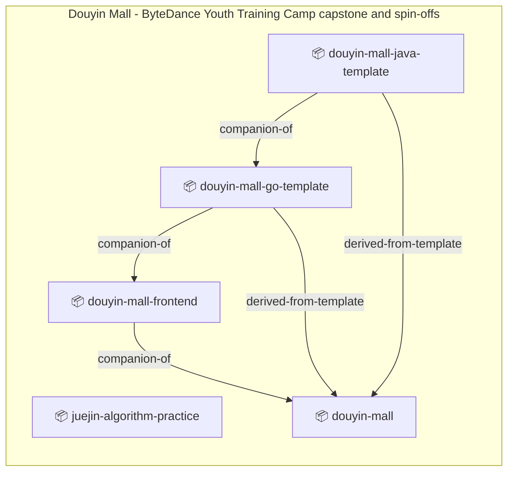

**Douyin Mall - ByteDance Youth Training Camp capstone and spin-offs** (`douyin-mall-bytedance`, 5 repos). The bootcamp's team capstone backend (Spring Boot + Redis + RabbitMQ, 5 contributors, Chan 49 of 178 commits) plus three artefacts Chan built on her own beyond camp scope: a solo Vue 3 storefront for that backend, and two bilingual open-source teaching templates (Go/Gin and Java/Spring Boot) distilled from the capstone. juejin-algorithm-practice is the camp's MarsCode algorithm curriculum (81 problems) that preceded the capstone.

- 2024-11: ByteDance Youth Training Camp (Team 115) begins (work id bytedance)
- 2024-12-21: juejin-algorithm-practice created (81 MarsCode problems with Python solutions)
- 2025-01-16: douyin-mall created (team capstone backend; contributors dawangshangshan 52, ChanMeng666 49, Gloss66 31, xiao-wu-z 18, water-free 16)
- 2025-01-17: douyin-mall-go-template created, one day after the capstone repo (Go + Gin + MySQL + Redis; 53 stars, the family's traction leader)
- 2025-01-22: douyin-mall-java-template created (Spring Boot + Maven counterpart)
- 2025-01-24: douyin-mall-frontend created (Vue 3 + TS storefront consuming the Spring Boot REST API)
- 2025-03: Camp ends (work id bytedance endDate)

### Chan personal projects (games, experiments, demos, study copies, analytics)

`personal` · personal · sole author · 35 repos in 10 families

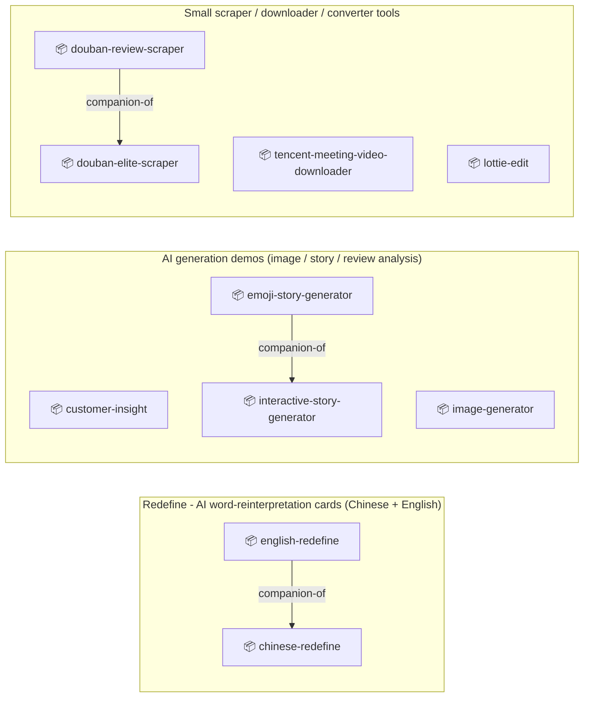

**Personal games, study archives, analytics** (`personal-experiments`, 3 repos). Standalone personal repos with no organisation link; included only because the task listed them.

Repos: 🔒 📦 JIEJOE (experiment), 🔒 📦 memory-rush (game), 📦 cloud-canals (game)

- 2025-05-17: JIEJOE tutorial study archive (private, archived 2026-10-02)
- 2026-02-14: memory-rush Love2D arcade game (itch.io)
- 2026-06-12: cloud-canals SVG puzzle game

**Redefine - AI word-reinterpretation cards (Chinese + English)** (`redefine-word-cards`, 2 repos). Same concept in two languages: AI reinterprets a word and exports a shareable SVG card. chinese-redefine (汉语新解, Gemini, 60 commits) was created 5 days before english-redefine (29 commits; README says OpenAI, GitHub description says Gemini). Both Next.js on Cloudflare Workers.

- 2024-11-12: chinese-redefine created from Create Next App (Gemini, SVG cards, rate-limit quota)
- 2024-11-17: english-redefine created, same card/SVG-export concept for English words

**AI generation demos (image / story / review analysis)** (`ai-generation-demos`, 4 repos). Four self-initiated generative-AI demos from 2024-11 to 2024-12 on different stacks: Next.js text-to-image (Together AI, later pivoted to Cloudflare Workers AI FLUX), and Python apps on Hugging Face Spaces / Streamlit (interactive story, emoji story, customer-review analytics). The two story generators are the closest pair (HF Spaces, Zephyr-class model, created 10 days apart); no code link found.

- 2024-11-20: customer-insight created (Streamlit sentiment/topic analysis)
- 2024-11-27: image-generator created (Together AI, Mondrian UI); later Vercel-to-Cloudflare pivot + credits/Stripe SaaS layer
- 2024-12-12: interactive-story-generator created (Gradio on HF Spaces)
- 2024-12-22: emoji-story-generator created (Streamlit on HF Spaces; later Llama-3.1-8B via HF Inference Providers)

**Personal Next.js web apps (relationship / job / library / email tools)** (`personal-nextjs-apps`, 4 repos). Independent self-initiated product experiments, 2024-10 to 2025-12, no shared code: friendscope (assessment tool), job-valuation (job scoring), library-os (multi-tenant library SaaS with live domain), send-joy (visual layer over Resend, started as a Christmas CLI).

Repos: 📦 friendscope (product), 📦 library-os (product), 📦 job-valuation (product), 📦 send-joy (product)

- 2024-10-30: friendscope and library-os both created the same day
- 2024-12-06: job-valuation created
- 2025-12-22: send-joy created as Christmas greeting email sender; pivoted to visual platform in 4 days

**Browser/indie games and interactive simulations** (`web-games-sprint`, 7 repos). Personal game experiments across engines (Canvas, Angular+Pixi, Kaboom.js, LOVE2D, Next.js cards/quiz). A clear burst 2026-02-01 to 02-09 (kaboom, leviathan, slime-split) alongside css-tower-defense (02-02), confirmed by owner as a game-jam / challenge month. ai-human-game credits UI/assets 'based on OOPTriviaGame (Pond Ponder) by PowerPuff People' (third-party/course-team asset origin).

Repos: 📦 html-brick-game (game), 📦 journey-of-reincarnation (game), 📦 otherworld-god-farmer (game), 📦 ai-human-game (game), 📦 kaboom-rpg-adventure (game), 📦 leviathan (game), 📦 slime-split (game)

- 2024-05-27: html-brick-game created (Canvas brick breaker)
- 2024-10-29: journey-of-reincarnation created (Next.js life-circumstance simulator)
- 2025-08-10: otherworld-god-farmer created (Angular 19 + Pixi.js farming sim)
- 2025-10-29: ai-human-game created (AI vs human content quiz)
- 2026-02-01: kaboom-rpg-adventure created
- 2026-02-06: leviathan created (AI-narrative political card game)
- 2026-02-09: slime-split created (LOVE2D, published on itch.io)

**Te Pa Tiaki - CSS Tower Defense (Guardians of Aotearoa)** (`te-pa-tiaki`, 1 repo). Chan's one still-live, still-showcased highlight in this partition (tier primary, not archived): 3D tower defense rendered purely with CSS 3D transforms, Maori-mythology themed, with a Cloudflare Workers + Hono + Neon backend, live at towerdefense.chanmeng.org. Created 2026-02-02 inside the Feb 2026 game burst; no sibling repos.

Repos: css-tower-defense (product)

- 2026-02-02: css-tower-defense initial release

**FanFic Lab (shuttered AI fanfiction product)** (`fanfic-lab`, 1 repo). Single-repo product line: began 2025-12-31 as a generic CopilotKit + LangGraph fanfic editor, redesigned in 2026-04 into an HSR (Honkai: Star Rail) DreamWriter adaptive agent with pgvector RAG and community features. Deployed Railway then DigitalOcean+Coolify at fanfic-lab.tech; live deployment retired 2026-07 (decommission ledger committed 2026-07-05); source stays public.

Repos: 📦 fanfic-lab (product)

- 2025-12-31: Initial commit from Create Next App (CopilotKit + LangGraph editor)
- 2026-04-03: HSR knowledge pack / DreamWriter pivot commits
- 2026-06-28: PRs #2/#3 billing integrity and paid-tier calibration
- 2026-07-05: decommission ledger added; fanfic-lab.tech retired

**Small scraper / downloader / converter tools** (`small-python-and-browser-tools`, 4 repos). Standalone utilities, 2024-11 to 2024-12: two Douban scrapers (group elite posts to Markdown; movie reviews + analysis), a Tencent Meeting recording downloader (Chrome Web Store extension), and a Lottie light/dark converter. The douban pair are siblings (same site, 8 days apart, same README template); the others are unrelated. Overlaps the ByteDance camp period but nothing links them.

- 2024-11-17: douban-elite-scraper created
- 2024-11-25: douban-review-scraper and tencent-meeting-video-downloader created the same day
- 2024-12-08: lottie-edit created

**Design / UI experiments and templates** (`design-experiments`, 5 repos). Front-end showcase experiments: CSS/GSAP design gallery, flip-book e-book template, Docusaurus minimalist blog with 3D, Blender-OBJ Three.js viewer, iOS podcast app prototype. design-pages and flip-book-template remain live (unarchived).

Repos: 📦 minimalist-good-post (experiment), design-pages (showcase), 📦 podcast-app-prototype (prototype), flip-book-template (template), 📦 perfume_obj (experiment)

- 2024-10-27: minimalist-good-post created (Docusaurus blog)
- 2025-07-02: design-pages created (CSS/GSAP gallery, GitHub Pages)
- 2025-08-15: podcast-app-prototype created (mental-wellness podcast UI)
- 2026-01-03: flip-book-template created as a generic e-book site template
- 2026-02-21: perfume_obj created (Three.js viewer for Blender OBJ; catalog id perfume-3d-viewer)

**Personal health / agent experiments (loose grouping, no relations)** (`personal-health-agent-experiments`, 4 repos). femtracker, femtracker-agent, panda-agent and hospital-roster-agent are each an independent personal project: not Sanicle-related and with no relations among them. They are grouped only so they are not scattered; the grouping asserts nothing.

Repos: 📦 femtracker (product), 📦 femtracker-agent (prototype), 📦 panda-agent (experiment), 📦 hospital-roster-agent (experiment)

- 2024-11-15: femtracker React Native/Expo v1.0.0
- 2025-06-13: femtracker-agent 8-agent CopilotKit app (merged into CopilotKit demos_2025, PR 2068); independent project
- 2025-07-13: hospital-roster-agent CopilotKit scheduling demo created
- 2026-01-12: panda-agent created

## Entities with a single repo

| Entity | Kind | Family | Repo | Role |
|---|---|---|---|---|
| FreePeriod (自在月行) | employer | freeperiod-site | 📦 free-period-website | marketing-site |
| Forward with Her (她行) Mentorship | community | forward-with-her-site | 📦 forward-with-her-mentorship-program | marketing-site |
| Chow Luck Club Ltd | client | eatropolis | 🔒 Chow-Luck-Club/eatropolis-website | product |
| Whiri-AI | client | tam-ai-ti | 🔒 Whiri-AI/tam-ai-ti-web | product |
| TechNest Community (teaching programmes) | community | ai-programming-teaching | ai-programming-teaching-project | docs |
| Aotearoa AI Hackathon Festival (AI Forum NZ x She Sharp x AUT) | programme | she-sharp-programmes | event-qa-ai-template | template |
| Aotearoa Infinite Academy | employer | esol-learning-platform | 📦 esol-learning-platform | product |

## Open questions

None open. Chan answered all 30 public questions (q01-q30) on 2026-10-02; the answers are applied above and kept in `lineage.yaml` under `resolved:` (id, date, answer). Notable outcomes: the awesome-* forks are listing submissions and not her projects (`ownProject: false`); the early personal-brand repos are independent, not a succession chain; the CORDE app was handed over and production runs the gentoo111 fork; femtracker and its siblings are independent personal projects; femtech-weekend-redthread is about to replace femtech-weekend-website in production; lottie-edit and lottie-theme-converter were one repo, now a single catalog entry. Three answers were worded ambiguously (q21, q24, q26) and were recorded without changing the map.

## Maintenance

When you create, archive, rename, transfer or delete a repo: update `lineage.yaml` (or the local overlay if the repo name is sensitive), then run `npm run check:ecosystem -- --live`. This README is hand-maintained prose around the catalog; regenerate or edit the diagrams when families change.
