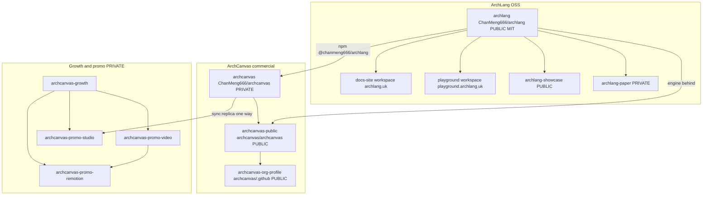

# ArchLang × ArchCanvas ecosystem map

Hand-authored topology for Cursor and other agents. **Not career data.** The machine catalog is [`archlang-archcanvas.yaml`](./archlang-archcanvas.yaml). That YAML is **not** loaded by `scripts/lib/load-profile.mjs` and is **not** schema-validated.

Last verified against local checkouts and git remotes: **2026-09-21**.

## Why this file exists

Read this before working on **any** ArchLang or ArchCanvas repository — language, product, growth, promo, paper, or showcase. It answers: which folder is which, what is public, what must never be linked, and which facts live where.

Career narrative (metrics, taglines, CV copy) stays in `data/profile/` shards. This file is **repo topology** only.

## Two products

| | ArchLang | ArchCanvas |
|---|---|---|
| What | Open-source floor-plan **language** and compiler. Write `.arch`, compile to SVG / DXF / PDF (plus PNG / ASCII), with lint and geometric checks. | Closed-source **AI design agent**. A plain-English brief becomes a dimensioned ArchLang plan on an infinite zoomable canvas, plus a grounded rendering. |
| Analogy | Typst / LaTeX, but for architecture. | The product that consumes the language. |
| Brand | SOURCE mark | COMPILED mark |
| Identity | Shared line: **Designs that compile**. |
| Live | https://archlang.uk · https://playground.archlang.uk | https://archcanvas.uk |
| npm | `@chanmeng666/archlang` | consumes that package (`^1.36.0` as of this map) |
| GitHub home | Personal account `ChanMeng666` | Org `archcanvas` for the **public face**; app source stays on `ChanMeng666/archcanvas` |

ArchLang stands alone. ArchCanvas is one consumer of it.

## Origin order

Easy to get backwards; the CV once did.

1. **Product first.** ArchCanvas first commit **2026-04-08**, drawing plans as freehand GPT-4o SVG.
2. **Language ~11 weeks later.** ArchLang npm `0.1.0` on **2026-06-24**.
3. **Engine swap.** ArchLang replaced the freehand engine on **2026-06-25**.

Never write “first invented the language, then built the product”.

## Family map

Two GitHub homes: the **language** lives under the personal account `ChanMeng666`; the product’s **public face** lives under the org `archcanvas`. The private application source is still `ChanMeng666/archcanvas`. The public repo `archcanvas/archcanvas` is **not** that source.

## Repo catalog

Ten top-level git checkouts under `D:/github_repository`, plus two **in-repo** sites that are not sibling clones.

### ArchLang

| id | Local path | Remote | Visibility | Role |
|---|---|---|---|---|
| `archlang` | `D:/github_repository/archlang` | `https://github.com/ChanMeng666/archlang.git` | **PUBLIC** MIT | Core DSL, compiler, CLI. npm `@chanmeng666/archlang`. VS Code `ChanMeng.archlang`. |
| `archlang-docs` | `D:/github_repository/archlang/docs-site` | *(no remote — workspace of archlang)* | in-repo | VitePress docs. Package name `archlang-docs`. Live: https://archlang.uk |
| `archlang-playground` | `D:/github_repository/archlang/playground` | *(no remote — workspace of archlang)* | in-repo | Live editor + SVG preview. Package name `archlang-playground`. Live: https://playground.archlang.uk |
| `archlang-showcase` | `D:/github_repository/archlang-showcase` | `https://github.com/ChanMeng666/archlang-showcase.git` | **PUBLIC** MIT | Fun compiled plans (famous buildings / TV / games). Gallery: https://archlang.uk/showcase |
| `archlang-paper` | `D:/github_repository/archlang-paper` | `https://github.com/ChanMeng666/archlang-paper.git` | **PRIVATE** | Academic papers + repro scripts. Stay private until acceptance. |

Also **inside** `archlang` (not sibling repos): `packages/mcp/`, `editors/vscode/`, `eval/`, `dataset/`, `examples/`, contributor `docs/`. HuggingFace dataset output is generated from `dataset/`; there is no sibling clone under `D:/github_repository`.

Pushing `archlang` `main` deploys both sites (Cloudflare Workers).

### ArchCanvas

| id | Local path | Remote | Visibility | Role |
|---|---|---|---|---|
| `archcanvas` | `D:/github_repository/archcanvas` | `https://github.com/ChanMeng666/archcanvas.git` | **PRIVATE** proprietary | The Next.js product. Live: https://archcanvas.uk |
| `archcanvas-public` | `D:/github_repository/archcanvas-public` | `https://github.com/archcanvas/archcanvas.git` | **PUBLIC** (app closed; docs/examples CC BY 4.0) | Public home: examples, docs, roadmap, community. **Not the app.** |
| `archcanvas-org-profile` | `D:/github_repository/archcanvas-org-profile` | `https://github.com/archcanvas/.github.git` | **PUBLIC** | Org profile README for `archcanvas`. |

### Growth and promo

| id | Local path | Remote | Visibility | Role |
|---|---|---|---|---|
| `archcanvas-growth` | `D:/github_repository/archcanvas-growth` | `https://github.com/ChanMeng666/archcanvas-growth.git` | **PRIVATE** | Strategy / research / marketing / ops HQ for **both** products. Second brain. English-only. |
| `archcanvas-promo-video` | `D:/github_repository/archcanvas-promo-video` | `https://github.com/ChanMeng666/archcanvas-promo-video.git` | **PRIVATE** | First promo archive: HyperFrames hero + shorts. |
| `archcanvas-promo-remotion` | `D:/github_repository/archcanvas-promo-remotion` | `https://github.com/ChanMeng666/archcanvas-promo-remotion.git` | **PRIVATE** | Second promo: Remotion “Zoom Out” (four aspect ratios). |
| `archcanvas-promo-studio` | `D:/github_repository/archcanvas-promo-studio` | `https://github.com/ChanMeng666/archcanvas-promo-studio.git` | **PRIVATE** | Third promo: Remotion film of a **coded replica** of the studio (not a screen recording). Four cuts (15 / 30 / 60 / 120 s) × two aspect ratios = eight masters. Music + synthesised SFX, no voiceover. Does not name ArchLang on screen. |

## Dependencies

| From | How | To |
|---|---|---|
| `archcanvas` | npm `@chanmeng666/archlang` | published ArchLang (not a `file:` checkout) |
| `archlang-showcase` | npm `@chanmeng666/archlang` | published ArchLang |
| `archlang-paper` | path `../archlang` | local ArchLang checkout; scripts fail if missing |
| `archcanvas-promo-video` | path `../archcanvas` | product asset trees |
| `archcanvas-promo-video` | editorial | `archcanvas-growth` positioning |
| `archcanvas-promo-remotion` | `npm run sync:assets` | `../archcanvas-promo-video` |
| `archcanvas-promo-remotion` | editorial | `archcanvas-growth` positioning |
| `archcanvas-promo-studio` | `npm run sync:replica` (one way, sha256 lock) | `../archcanvas` studio-replica component |
| `archcanvas-promo-studio` | editorial | `archcanvas-growth` positioning |

**No code dependency:** `archcanvas-growth`, `archcanvas-public`, `archcanvas-org-profile` (docs, links, examples only).

## Do not confuse

| Trap | Reality |
|---|---|
| `docs-site/` looks like its own repo | It is an npm workspace **inside** `archlang`. No sibling clone. |
| `playground/` is ArchCanvas | It is the in-repo Vite playground at playground.archlang.uk. ArchCanvas is archcanvas.uk. |
| Local folder `archcanvas-public` is the app | It is `archcanvas/archcanvas` — public docs and examples. App source is private `ChanMeng666/archcanvas`. |
| Language keyword `paper` (sheet size in `.arch`) | Academic papers live in private `archlang-paper`. Extracted from `archlang` on 2026-08-26. |
| `examples/` in archlang | Small in-repo fixtures. Curated gallery **sources** live in `archlang-showcase`. Docs-site `/showcase` PNGs are synced copies, not the source of truth. |
| `archcanvas-growth` is the product | It is the private second brain. Product facts stay in `archcanvas` and `archlang`. Growth must not restate them. |
| `package.json` `"private": true` on showcase | Means “not published to npm”, **not** “the GitHub repo is private”. Showcase is public MIT. |
| `readme-showcase` under `D:/github_repository` | Unrelated README-screenshot skill. Name collision only. |
| `app-promo-studio` in ChanMeng666 career shards | Unrelated project id. The ArchCanvas film checkout is **`archcanvas-promo-studio`**. |

## Truth ownership

| Kind of fact | Lives in | Do not |
|---|---|---|
| Language behaviour, compiler, CLI, sites | `archlang` (`AGENTS.md`, `src/`, `docs/agents/`) | Copy product claims into the language repo |
| Product behaviour, pricing implementation, app architecture | `archcanvas` (`CLAUDE.md`, `README.md`, `src/`) | Restate them in growth |
| Strategy, research, launch copy, kill criteria | `archcanvas-growth` | Treat growth as product truth; do not edit product repos from growth |
| Career / CV / LinkedIn / README profile | this repo’s `data/profile/` — work `id: archcanvas`, projects `id: archlang` and `id: archcanvas` | Put topology into the shards (it would leak onto generated surfaces) |
| Promo on-screen copy | growth for positioning; each promo repo for cleared phrases | Invent taglines; Zoom Out and the studio replica film do not name ArchLang on screen |

Public copy rules (from the work-entry evidence comments in `data/profile/10-career.yaml`):

- **Never link** `ChanMeng666/archcanvas` or `ChanMeng666/archcanvas-growth` (or the promo / paper remotes) in public copy.
- Public GitHub links: `github.com/ChanMeng666/archlang` and `github.com/archcanvas/archcanvas`.
- No traction claims unless the career shards have been re-read and updated.

## Agent loading

1. This markdown — topology.
2. [`archlang-archcanvas.yaml`](./archlang-archcanvas.yaml) — structured ids, paths, remotes.
3. Then the **target repo’s** own `AGENTS.md` / `CLAUDE.md`.
4. Career copy: `data/profile/10-career.yaml`, `23-projects-oss-more.yaml`, `90-meta.yaml` (`flagshipProjectIds: [archlang, archcanvas]`).

Do not add this map’s local `D:/` paths to product-repo `AGENTS.md` files. Those files are for every contributor, not this machine.

## Checked and excluded

Top-level scan of `D:/github_repository` on 2026-09-21: **ten** matching git folders, listed above. `docs-site` and `playground` exist only inside `archlang`. The third promo checkout is `archcanvas-promo-studio` — not `app-promo-studio` (an unrelated career-shard project).

| Path | Why it is not in the catalog |
|---|---|
| `D:/github_repository/readme-showcase` | Unrelated screenshot skill (`ChanMeng666/readme-showcase`). |
| `D:/github_repository/ChanMeng666` | This career database. It **hosts** the map; it is not a product repo. |
